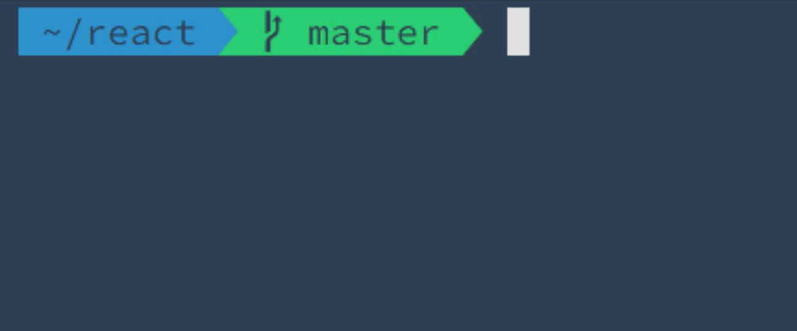
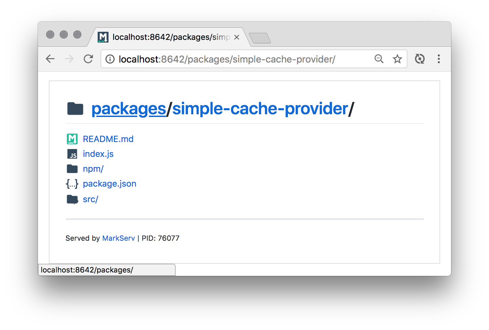
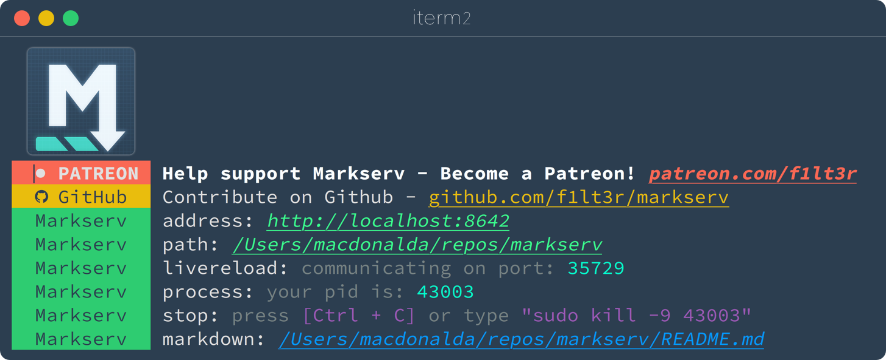
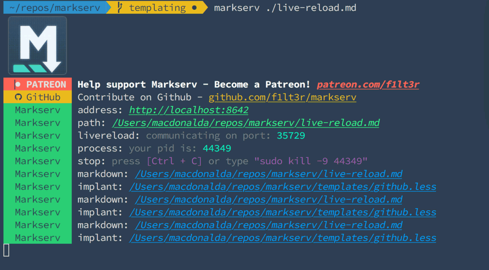

<p align="center">
	
</p>

> :checkered_flag: serve markdown as html (GitHub style), index directories, and live-reload as you edit

[](https://gitter.im/markserv)
[](CHANGELOG.md)
[](https://travis-ci.org/markserv/markserv)
[](https://coveralls.io/github/markserv/markserv?branch=master) [](#contributors) [](https://www.npmjs.com/package/markserv)
[](https://github.com/sindresorhus/xo)
[](https://snyk.io/test/github/markserv/markserv)

<p align="center">
	
</p>

## :sparkles: Features

- Markdown content rendered as HTML
- GitHub flavor CSS and Syntax Highlighting
- [Just in Time Templating](#stopwatch-just-in-time-templating): Markdown, HTML &amp; LESS
- LiveReload as you edit
- Directory indexes
- MIME Type file support

Supporting: [MathJax](tests/mathjax.md), [Chinese Characters](tests/测试.md), [Table of Contents](tests/toc.md), [Tables](tests/tables.md), [Heading Anchors](tests/links.md)

<p align="center">
	
</p>

## :computer: Installation

```shell
# NPM
$ npm i -g markserv

# Yarn
$ yarn global add markserv
```

## :joystick: Usage

To start Markserv from the CLI

```shell
# Open closest README.md
$ readme

# Open file
$ markserv README.md

# Open a directory
$ markserv node_modules
```

<p align="center">
	
</p>

Start Markserv and open a file or directory.

```shell
# File
$ markserv ./path/to/file.md

# Directory
$ markserv ./
```

Start Markserv and open the closest README.md file in the browser:

```shell
$ readme
```

## :zap: Live Reload

To see real-time updates as you save your markdown files, you will need to install the LiveReload plugin for your browser:

- [Chrome](https://chrome.google.com/webstore/detail/livereload/jnihajbhpnppcggbcgedagnkighmdlei?hl=en)
- [Firefox](https://addons.mozilla.org/addon/livereload-web-extension/)
- [Internet Explorer](https://github.com/dvdotsenko/livereload_ie_extension)

With the Live Reload plugin installed and turned on, you should see the page reloading as you save your Markdown file.

<p align="center">
	
</p>

## :link: Markdown Links

You can link to an external Markdown file in the same way that you use GitHub Wiki links. You can use the example code here to see how external links work.

Example code:

```markdown
[Skateboarding Dog!](tests/Linked-Markdown-Example.md)
```

Example link:

[Skateboarding Dog!](tests/Linked-Markdown-Example.md)

## :stopwatch: Just in Time Templating

Markserv allows you to include nested content. Templates are fetched and rendered when you request them in your browser. The `maxDepth` of includes is set to `10`.

If you would like to look at an example, you can look in the [tests/templates](tests/templates/) directory of this repo.

To see the server output of this templating example:

```shell
$ git clone@github.com/f1lt3r/markserv.git
$ cd markserv
$ markserv tests/templates/index.html
```

### Include Markdown

Note: Any markdown files that you include will be transformed to HTML.

Where `foo/bar/baz/qux.md` equals:

```markdown
## Qux
```

And Markserv renders the following content:

```markdown
# Include Markdown
{markdown: foo/bar/baz/qux.md}
```

The server response will be:

```html
<h1>Include Markdown</h1>
<h2>Foo Bar</h2>
```

### Include HTML

Where `foo/bar/baz/qux.html` equals:

```html
<h2>Qux</h2>
```

And Markserv renders the following content:

```markdown
# Include Markdown
{html: foo/bar/baz/qux.html}
```

The server response will be:

```html
<h1>Include Markdown</h1>
<h2>Qux</h2>
```

### Include LESS

Note: Any LESS files that you include will be transformed to CSS.

Where `foo/bar/baz/qux.css` equals:

```less
@link-color: green;
a {color: @link-color}
```

And Markserv renders the following content:

```html
<style>{less: foo/bar/baz/qux.css}</style>
```

The server response will be:

```css
<style>
a {
  color: #008000;
}
</style>
```

## :crossed_flags: Flags

To list the options/flags for the markserv CLI tool:

```shell
$ markserv --help
```

### Changing the HTTP Port

You can change the HTTP Port like this:

```shell
markserv -p 80
```

### Making Markserv available to external networks

In some cases `localhost` might be the address on which the server is listening, in which case it is hard to make the site available to external networks even with the right IP. Use the following as an example to make sure the server is accessible from external networks:

```shell
markserv -p 8642 -a 0.0.0.0
```

Above example runs the server on port `8642` and it can be accessed from external networks using public IP of the machine on which the server is running. If you want the server to keep running in a seperate thread even when you log out, use this:

```shell
nohup markserv -p 8642 -a 0.0.0.0 &
```

This will make the server instance persistent and will be available to access even when you log out or even when your ssh session closes (in case you are accessing a remote machine through ssh to set up `markserv` server)

## :cupid: Credits

- Logos used in the directory list: [PKief - vscode-material-icon-theme](https://github.com/PKief/vscode-material-icon-theme)
## Contributors

Thanks goes to these wonderful people ([emoji key](https://allcontributors.org/docs/en/emoji-key)):

<!-- ALL-CONTRIBUTORS-LIST:START - Do not remove or modify this section -->
<!-- prettier-ignore-start -->
<!-- markdownlint-disable -->
<table>
  <tr>
    <td align="center"><a href="https://f1lt3r.io"><br /><sub><b>Alistair MacDonald</b></sub></a><br /><a href="https://github.com/f1lt3r/markserv/commits?author=F1LT3R" title="Code">💻</a></td>
    <td align="center"><a href="https://finenet.com.tw"><br /><sub><b>陳瀛洲</b></sub></a><br /><a href="https://github.com/f1lt3r/markserv/commits?author=ChenYingChou" title="Code">💻</a></td>
    <td align="center"><a href="https://kflu.github.io/"><br /><sub><b>Kefei Lu</b></sub></a><br /><a href="https://github.com/f1lt3r/markserv/commits?author=kflu" title="Code">💻</a></td>
    <td align="center"><a href="https://www.imyzf.com"><br /><sub><b>Zhenfei You</b></sub></a><br /><a href="https://github.com/f1lt3r/markserv/commits?author=imyzf" title="Code">💻</a></td>
    <td align="center"><a href="https://github.com/anslzo"><br /><sub><b>Andrew</b></sub></a><br /><a href="https://github.com/f1lt3r/markserv/commits?author=anslzo" title="Code">💻</a></td>
    <td align="center"><a href="https://daniel.perez.sh"><br /><sub><b>Daniel Perez</b></sub></a><br /><a href="https://github.com/f1lt3r/markserv/commits?author=danhper" title="Code">💻</a></td>
    <td align="center"><a href="https://github.com/sushruth"><br /><sub><b>Sushruth Shastry</b></sub></a><br /><a href="https://github.com/f1lt3r/markserv/commits?author=sushruth" title="Code">💻</a></td>
  </tr>
  <tr>
    <td align="center"><a href="https://ptkdev.it"><br /><sub><b>Patryk Rzucidło</b></sub></a><br /><a href="https://github.com/f1lt3r/markserv/commits?author=ptkdev" title="Code">💻</a></td>
    <td align="center"><a href="https://github.com/EstebanMarin"><br /><sub><b>EstebanMarin</b></sub></a><br /><a href="https://github.com/f1lt3r/markserv/commits?author=EstebanMarin" title="Code">💻</a></td>
    <td align="center"><a href="https://matthewreishus.com/"><br /><sub><b>Matthew Reishus</b></sub></a><br /><a href="https://github.com/f1lt3r/markserv/commits?author=mreishus" title="Documentation">📖</a></td>
    <td align="center"><a href="https://github.com/danielwe"><br /><sub><b>Daniel Wennberg</b></sub></a><br /><a href="https://github.com/f1lt3r/markserv/commits?author=danielwe" title="Code">💻</a></td>
    <td align="center"><a href="http://thepete.net"><br /><sub><b>Pete Hodgson</b></sub></a><br /><a href="https://github.com/f1lt3r/markserv/commits?author=moredip" title="Code">💻</a></td>
    <td align="center"><a href="https://github.com/ghost"><br /><sub><b>Deleted user</b></sub></a><br /><a href="https://github.com/f1lt3r/markserv/commits?author=ghost" title="Documentation">📖</a></td>
    <td align="center"><a href="https://www.ldaws.com"><br /><sub><b>Liam Dawson</b></sub></a><br /><a href="https://github.com/f1lt3r/markserv/commits?author=liamdawson" title="Code">💻</a></td>
  </tr>
</table>

<!-- markdownlint-enable -->
<!-- prettier-ignore-end -->
<!-- ALL-CONTRIBUTORS-LIST:END -->

This project follows the [all-contributors](https://github.com/all-contributors/all-contributors) specification. Contributions of any kind welcome!
